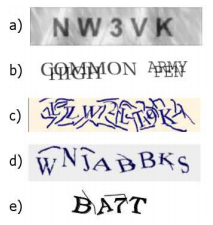

# 前言

当今人们越来越依赖Web服务，如查看E-mail，淘宝购物，百度搜索，这些Web服务已经和我们息息相关，我们很难想象没有他们的生活。而对于这些服务的提供者来说，确保服务资源能真正被用户使用，而不是被恶意机器人使用，是至关重要的。如使用机器人注册账户[@baird2002human]，不仅会占用宝贵服务器资源，还为发布恶意信息埋下伏笔。所以区分访问来自人类还是机器人是十分重要的，验证码正是因为这个原因而被广泛使用。验证码（CAPTCHA）是“Completely Automated Public Tests to tell Computers and Humans Apart”[@baird2002human;@chellapilla2005designing;@rui2003excuse;@von2003captcha;@von2004telling]。的缩写。其主要思想是通过电脑向人类提问，通过回答来区分人和机器人。这个问题需要对人来说简单，而对电脑来说很难（或是需要很长时间）解决。

# 背景

目前在互联网上最流行的CAPTCHA系统，是基于文本的。但是，由于计算机视觉技术的提高，基于文本的系统很容易被攻击成功[@yan2008low;@mori2003recognizing;@simard2005using]。所以越来越多的研究者考虑如何替换掉基于文本的系统，于是有基于图像的[@elson2007asirra;@gossweiler2009s;@chew2004image;@datta2005imagination;@matthews2010scene;@zhu2010attacks]和基于声音的[@chan2003using;@bigham2009evaluating]系统。

## 文本验证码系统

总的来说，基于文本的验证码系统让用户识别字母或数字，GIMPY是一个经典的例子[@gimpy]。攻击基于文本的使用大多使用OCR(optical character recognition)。这个技术讲图片分割成晓得区域，每个区域只有一个字母，然后使用模式识别技术使用字母模板匹配每一个区块[@mori2003recognizing;@yan2008low;@simard2005using]。最后一步是一个比较成熟的AI问题。为了防止这样的攻击，基于文本的系统使用如下技术来增强鲁棒性[@el2010robustness;@chellapilla2005designing]：

- 增加噪音：向图片中增加线和点，来干扰区域分割算法。
- 字符扭曲：对字符使用扭曲变换，或3D变换来增加文字识别难度。
- 字符连接或重叠：将两个或者多个字母连接或者重叠起来，使得攻击算法无法正确划分图片。

{#fig:text-captcha}

如 @fig:text-captcha ，a很容易被OCR破解，b引入了字符的重叠，c引入了噪声，d和e同时引入噪声和字符扭曲。

然而，以上方法在提高系统鲁棒性的同时，也提高了人类识别的难度，特别是字符的连接。如字符“r”和“n”连接起来，看起来就像是字符“m”。字符扭曲也有可能增加用户识别的难度，如扭曲的后的”S“和”5“就很难分辨。还有些系统使用不同的颜色来标示每个字符，而这些都能很容易的被自动化的程序所移除，并没有给机器识别带来任何的难度[@yan2008usability]。而reCAPTCHA[@googlerecaptcha]提供了一种比较好的解决思路：使用两个单词来验证用户，其中一个是确定答案的，另外一个是不确定的。不确定答案的单词来自古籍中无法被自动化OCR程序识别的单词，确定答案的单词是机器生成的或者多个用户的答案是一致的来自古籍中的单词。这个过程既可以起到验证作用又可以数字化图书，是一个非常好的解决方案。但是还是这个解决方案还是有如下缺点：

- 对移动用户不友好：移动设备通常屏幕较小，输入困难，输入较长的单词对用户来说是一个极大的负担。
- 无法防御基于机器学习的攻击：基于机器学习的攻击，能比较容易的识别文本，此方法对与基于机器学习的攻击没有很好的鲁棒性。
- 易导致用户多次刷新：由于一个单词来自古籍，可能出现用户多次刷新来获得清晰可读的验证码，而这对热门Web服务器来说，是一个极大的负担。

正是由于基于文本的系统固有的缺点，有了声音验证系统和图像验证码系统。

## 声音验证码系统

声音验证码系统弥补来了视觉障碍用户的可用性需求。一般的声音验证码系统让字母和数字被随机的声音间隔隔开，并向其中添加背景噪声。用户只有很少的时间去确定每个单词。某种意义上说，声音验证码系统仅仅是文本验证码系统的听觉版本，用声音替代可视化的东西，并没有明显的增加破解的难度。构成攻击的基础是相似的——特征提取和字符分类。对机器和人的难度曲线是相似的[@bursztein2011failure]。所以声音验证码系统既没有提供更加用户友好的接口，也没有更好的防范自动化程序的破解。这也就是它没有被广泛使用的根本原因。

## 图像验证码系统

图像验证码系统逐渐替代了越来越复杂的文本验证码系统，图像验证码有很好的用户接口，它主要利用人类对图片超乎想象的处理能力来区分人和机器。ESP-PIX[@esp-pix]让用户从一系列词中选择能描述素有图片的。SQ-PIX[@sq-pix]让用户标示出物品的所在位置，这对图片候选库提出很大要求，大部分图片可能需要人工处理。Google的图片验证码“what's up”[@gossweiler2009s]让用户旋转图片，把图片旋转至正确方向。这个过程需要比较精确的鼠标移动，并且有些图片的方向可能是模棱两可的。Microsoft的Asirra[@elson2007asirra]使用petfinder.com上已有的数据库，让用户在12张图片中找到所有有猫的图片（其他图片都为狗）。而这些图片可能是模棱两可的，如 @fig:asirral 中，左图中既有猫也有狗，右图中有一只长得像狗一样的猫。这样的验证码这个对于机器来说，难度只有区分狗和猫，而对于人来说，却可能花费很长时间解决。

{#fig:asirral}

12306火车购票[@captcha12306]让用户从所有图片中选择系统指定内容的图片，如 @fig:12306captcha 。但是同样也存在一个致命的问题：图片需要人工导入，并手动指定标签。有如下缺点：

- 人工失误：人工指定标签时给出错误标签
- 易遭受穷举攻击：因为人工指定，图片库不可能太大，穷举所有图片，并自动或手动指定标签即可很好的破解此类验证码
- 手工录入的标签信息很难复用：花费大量人力物力输入的信息除了验证码，并不能用在其他地方。

{#fig:12306captcha}

正是由于图片验证码系统普遍有需要手动录入图片的缺点，本文提出了一种**图片数据库自动增长**的方案来解决这个问题。

# 图片验证码自增长系统设计

不同于文本验证码系统，文本验证码系统可以生成问题图片，而图片验证码系统生成问题的过程很依赖图片数据库。这就决定图片数据库是图片验证码系统中至关重要的角色。图片数据库的的数据量大小和质量好坏，直接影响图片验证码系统的鲁棒性和用户友好性。数据量大能很好的避免穷举攻击，而数据质量高，能很好提升系统的用户友好性。如何提高图片数据库的数据量和数据质量，成了现在大多数验证码系统亟待解决的问题[@chew2004image]。本文创新性的提出了一种图片验证码系统图片数据库自增长策略，能很好的解决这个问题。同时，本系统在设计之初就考虑到图片数据库复用问题：利用海量数据，服务于图片语义化搜索。这使得本系统合理利用用户完成验证码过程中输入，为搜索引擎的图片语义化搜索做出贡献。

## 思路

reCAPTCHA系统是基于文本的验证码系统，是借助于人类大脑对难以识别的字符的辨别能力，进行对古旧书籍中难以被OCR识别的字符进行辨别的技术。这是一个很好的”增长“思路。本系统参考了reCAPTCHA系统，将其改进以适应图片验证码系统。

### reCAPTCHA系统

每次验证码会显示两个单词让人来识别，其中一个是需要用户识别的难认词，另外一个是答案已知的词。软件将能够正确识别答案已知词的用户看作是人类，当答案已知的词被正确识别出来后，程序会记录用户对无法阅读的词的回答并将其添加到它的数据库中。这样就完成了一次人工的OCR识别。为了改善软件的精确性， reCAPTCHA 会将最困难的词发送给多个用户并挑选其中有相同答案的作为正确的答案，确率能够达到99%。用户每使用一次这个程序，实际上就是在帮助数字重现古籍。这项技术已经被Google广泛使用。

reCAPTCHA系统提供了很好的利用用户输入来完成某种目的的思路。即利用用户对OCR无法识别单词的输入，完成古籍数字化工作。相思的思想可以用在图片验证码系统上吗？答案是肯定的。我们可以让**用户选择两种物体，其中一个的答案是确定的，起验证作用；另外答案一个是不确定的，起增长作用**。但是在实施的时候，任然需要对reCAPTCHA系统进行很多改进，才能使之很好的用在图片验证码系统上。

### 图片验证码的自学习与reCAPTCHA系统差异

图片验证码的自学习策略并不能直接把reCAPTCHA系统思路方案拿来使用，这由于图片验证码系统和文本验证码系统有着本质的区别：

- 验证问题生成：图片验证码依赖图像数据库，而reCAPTCHA系统一般是由系统随机选择一个单词，然后由系统生成一张包含单词图片交由用户识别。
- 用户输入类型：图片验证码一般是让用户点击选择图片，而reCAPTCHA系统是让用户输入图片中的文本。
- 图像分割：图片验证码需要预先将一张图片上物体分离出来，而reCAPTCHA系统只需要讲古籍上的单个字体提取出来，这个二者的难度完全不在一个量级。
- 预识别：图片验证码需要预先对图片加上描述标签，而reCAPTCHA系统并不需要任何预识别。

正是由于以上差异，图片验证码系统自学习系统要比reCAPTCHA复杂得多。其中特别是图像分割[@许新征2015图像分割的新理论和新方法;@林开颜2005彩色图像分割方法综述;@丁亮2010图像分割方法及性能评价综述;@Felzenszwalb2004]和预识别[@le2015deep;@simonyan2014very;@ciresan2012multi]部分，涉及计算机视觉以及人工智能领域。

### 自增长策略

不同与reCPATHCHA，我们可以讲古籍中的单词抠出后，经过少许处理即可交由用户。图片自学习系统不太可能设计成让用户输入图片中物体的名称，因为多个用户输入的图片名称可能是多个近义词或同义词的集合，如：土豆和马铃薯，这样就没有办法很好的规约图片中主体的名称。正是考虑到这个因素，我们需要对图片进行预识别，然后通过用户选择图片这一过程来验证机器的识别。即：需要用户选择带有两种标签的全部图片，其中带有确信标签（确信标签为 `true`）图片起到真正的验证作用，而用户是否选择非确信标签（确信标签为 `false`）的图片作为验证机器识别的依据。

大体过程如下：

1. 将 [Visual Dictionary](http://groups.csail.mit.edu/vision/TinyImages/) 中带有标签图片的数据输入数据库中，并将他们的确信标签置为 `true`
2. 使用预先有标签的图片数据集训练深度神经网络，使其具备初级的图片识别能力
3. 通过爬虫从网络上爬取图片
4. 将爬取图片筛选，初步处理
5. 将图片分割（image segmentation）成带有物体的子图（称为**主体**）
6. 使用具有初级图片识别能力的深度神经网络对图片标定预标签（标定多个标签，按置信度排序）
7. 将识别结果存入图片数据库中，并置确信标签为 `false`
8. 按一定比例使用确信标签为 `true` 和 `false` 的*主体*生成图片验证码*问题*
9. 将用户验证成功的*问题*中是否选中确信标签为 `false` 的*主体*信息记录到数据库中
10. 当确信标签为 `fasle` 的*主体*验证次数和准确率都超过预先设定的阈值时，将确信标签置为 `true`；当确信标签为 `fasle` 的*主体*验证码次数超过，而准确率低于预先设定的阈值时，将标签置换为下一标签（置信度仅此与当前标签的标签），重置验证次数和准确率
11. 按一定时间时间或者按由 `false` 转为 `true` 的标签数量达到预先设定的值时，使用*主体*继续训练深度神经网络

顶级流程图如{@fig:flow}。

{#fig:flow}

## 设计

本系统希望达到如下目标：

- 适应人类：自动淘汰图片数据库中含糊不清的图片，去掉模棱两可的图片，更加逼近人类去图片的理解
- 自动增长：通过爬虫自动下载网络上的图片，自动将图片分割成*主体*并预识别图片中的内容，打上预识别标签。
- 合理验证码生成：通过使用合理比例确信与不确信的主体来生成验证码，使得：1)可以验证访问是否是人类；2)能为系统自增长提供依据
- Web服务：实现自增长，需要数以亿记的用户使用长期使用才能达到自增长目的。所以我们期望将系统设计为Web服务类型，向其他网站提供服务，来提高自己的用户量。这其中需要解决两个问题：1)大并发访问；2）服务认证

正是基于上面的考量，本系统在设计时需考虑多个因素，使得本系统，人性化，用户友好，并有很好的鲁棒性。

### 适应人类

本系统的初始确信图片为 [Visual Dictionary](http://groups.csail.mit.edu/vision/TinyImages/) 中带标签的图片数据，然而这些图片中可能存在模棱两可或是模糊不清的图片。如果使用这样的图片来判定用户是否为人类，可能造成：

- 判定失误：有些图片对人类来说也是很难辨认的
- 丧失用户友好性：用户可能对验证过程厌恶
- 高服务器负载：本系统设计为 Web 服务，本身存在高并发问题。如果使用这样的图片，会大大提高用户刷新验证码的概率，进而提高服务器负载

可见，数据库中如果存在模棱两可或是模糊不清的图片可能会对系统造成毁灭性打击，所以如何降低这种图片在数据库中的比例尤为重要。

我们的系统引进了一种**淘汰机制**。具体实现如下：

1.记录所有*主体*总共出现次数和答对概率
2.设计定时任务计算所有出现次数大于阈值的*主体*答对概率的均值 $\mu$ 和 $\sigma$
3.淘汰所有答对概率低于 $\mu-3\sigma$ 的*主体*

这里我们根据概率统计中的大数定理可知，任意分布的样本，在取样足够大时，无线逼近正态分布。在这里使用 $3\sigma$ 原则，理论上可以排除异常样本。

### 图片爬虫

为实现自增长，系统系统需要不断的从互联网上爬取图片来实现系统数据库的自增长。为了这个目的，我们需要使用爬虫来爬取互联网上图片。相比与其他复杂爬虫，这里的爬虫相对简单：只需要下载互联网上图片即可。

##### 爬虫策略

爬虫是一种定向抓取网页资源的程序，它根据抓取目标，有选择的访问互联网上的网页与相关连接来获取所需要的信息。在我们的系统中，爬虫的任务很简单：下载互联网上的图片。

目前主流的爬虫网页搜索策略为以下3种：

- 广度优先搜索：广度优先搜索策略是指在抓取过程中，完成当前层次的搜索后，才进行下一层次搜索。目前为了尽可能多的涵盖所有网页，一般使用这种方法。其基本思想是很大概率上与初始链接在一定距离内的网页具有主题相关性。一般配合网页过滤技术，将无关网页过滤掉。缺点是抓取网页增多，会将大量无关网页下载并过滤掉，让其执行效率变低。

- 最佳优先搜索：最佳搜索是按一定的算法，预测候选链接与目标网页的相似度，或主体相关性，将其从大到小排列，选取前几个来你就进行搜索。这种算法某种意义来说，是一种贪婪算法，容易陷入局部最优解而不能很好的获得结果。因此需要将最佳优先结合具体应用进行改进，以跳出局部最优点。

- 深度优先搜索：深度优先搜索策略从起始网页开始，选择一个链接进入，分析这个网页中的链接，选择一个再进入。如此一个链接一个链接地抓取下去，直到处理完一条路线之后再处理下一条路线。该算法的设计和实现相对简单。这种策略抓取深度直接影响着抓取命中率以及抓取效率，抓取深度的合理设定是该种策略的关键。相对来说，这种策略很少使用。

我们系统中需要抓取包含尽可能多的*主体*的图片（准确来说是单位像素包含主体最多的图片，我们的系统要求*主体*不能过小，以至于模糊不清）。需要做到：

- 固定搜索域：我们的期望下载的图片是包含多个主体的，而互联网上的图片很难保证这点，所以我们需要固定搜域到某个网站下，以免爬虫跳出。具体选择那个网站作为我们图片的来源，这里涉及版权、法律和政治问题，需要考虑很多因素，这里不再详细说明。

- 筛选图片：对网站背景之类的图片予以过滤，并过滤掉较小的图片。

- 保证相关性：可以认为相关的图片内容项可能是相似的，我们要求图片中尽可能多的包含*主体*，这就要求我们的找到的图片，和“拥有多的*主体*的图片是相关的。

综上，我们的最佳选择最佳搜索策略。

### 图片分割

从网上爬取的图片一般来说，内容杂乱，主体不明，我们期望的拉去图片如 @fig:download-image 中的 a)，然而实际拉取的图片可能存在以下问题：

1. 一张图片包含多个*主体*：大多数的图片是包含多个*主体*的，主体之间可能是重叠的，互相遮蔽的。如 @fig:download-image 中的 b)。

2. 图片可能不包含*主体*：有些图片，如桌面壁纸类的图片可能不包含任何*主体*，如 @fig:download-image 中的 c)。

正是存在这些问题，我们非常有必要对图片进行分割：对于包含多个*主体*的图片，分割出*主体*子图：对于不包含*主体*的图片，分割出0个*主体*子图。

{#fig:download-image}

图像分割是一个比较难解决的问题，常见分割算法有：

- 基于阈值的分割方法：阈值分割是一种直接对图像灰度信息阈值化处理算法，它简单的用几个阈值将图像灰度直方图进行分类，将灰度值在同一个类内的像素归为同一个物体 @丁亮2010图像分割方法及性能评价综述 。其实现简单、成本低廉、实用性强；但当图像灰度不明显，或是多个物体灰度有大部分灰度重叠时，容易分割错误 @丁亮2010图像分割方法及性能评价综述 。

- 基于边缘的分割方法：边缘一般以突变的形式出现，或者说是不同*主体*之间像素灰度值变化比较剧烈的地方；根据高等数学的有关知识，这类方法一般采用图片一阶导数极值和二阶导数满足某种约束作为边缘点的判断依据，其优点：边缘定位准确，运算速度快；其局限性：边缘连续性和封闭性难以保证，对于复杂图像分割效果差，会出现如：边缘模糊、边缘丢失等现象。边缘检测方法常常依赖于边缘检测算子，常用的检测算子有：Sobel（对噪声具有一定平滑，但精度低）、Roberts（精度高、对噪声敏感）、Canny（检测阶跃型边缘效果好，抗噪强）、Prewitt、Laplacian和Marr算子。

- 基于区域的分割方法：这类方法主要考虑了图像的空间信息，如图像纹理、颜色、灰度和像素的统计特性等，进而将目标对象划分为同一区域的分割方法。常见的区域分割方法主要有：区域生长法、分裂合并法和分水岭分割方法。

- 基于小波分析和小波变换的图像分割方法：小波（Wavelets）是目前在许多工程和科学技术中一个非常热门的话题，它具有良好的视频局部变化和多尺度变换特性，以及多分辨率分析的能力 @崔锦泰1995小波分析导论 。小波变换的模极大值点对应于信号的突变点，在二维空间情况下，小波变换适用于检测
图像的局部奇异性，故可通过检测模极大值点来确定图像的边缘。

- 基于人工神经网络的图像分割方法：人工神经网络（ANN）是大规模神经元互联组成的高度非线性系统，是在认识、理解人脑的组织结构和运行机制的基础上，模拟其结构和智能行为的一种工程系统。基于神经网络图像分割方法的基本思想是：通过训练多层感知器（Perceptron）来得到决策函数，然后用决策函数对象素进行分类来达到分割目的。

好的视频局部变化和多尺度变换特性，以及多分辨率分析的能力
，特别是针对不同的数据集进行迁移学习 TODO:

### 图像预识别

### 验证码生成

### 置信标签修改

### 大数据处理

### Web 服务

我们的自增长系统需要数以亿计的用户使用,才能实现良好的自增长。为此仅仅嵌入到几个网站中使用并不能达到我们的目的。所以 Web 服务是最好的选择，即提供一定的 API 给用户，用户调用即可完成CAPTCHA（Completely Automated Public Tests to tell Computers and Humans Apart）。这里称提供CAPTCHA服务的服务器为验证服务器，提供 Web 应用服务的服务器为应用服务器，用户为客户机。

TODO:

#### 模型

#### 授权与数字签名

# 图片验证码自增长系统分析

## 可用性

## 安全性

## 稳定性

# 图片验证码自增长系统评估

## 实现例子

## 用户研究

### 研究方案

### 时间统计

### 精确度统计

### 自学习策略

# 存在问题和改进空间

# 总结

\begin{thebibliography}{99}

\end{thebibliography}