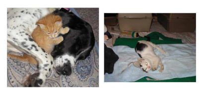
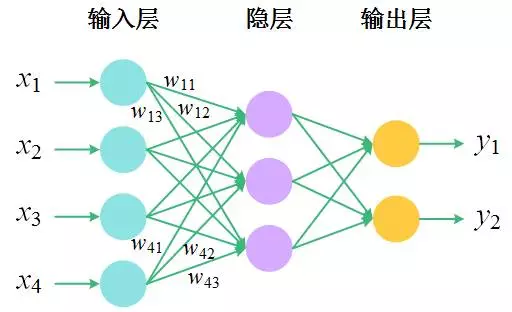
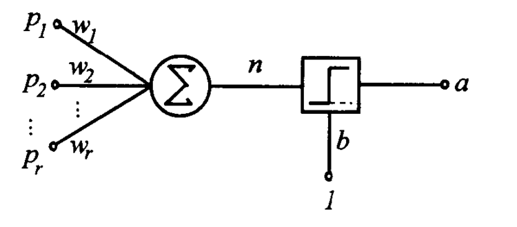
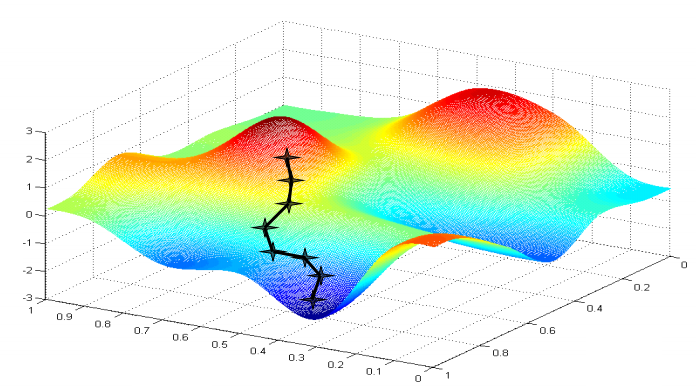

# 前言

当今人们越来越依赖Web服务，如E-mail，淘宝购物，百度搜索，这些Web服务已经和我们息息相关，我们很难想象没有他们生活会变成什么样。而对于这些服务的提供者来说，确保服务资源能真正被用户使用，而不是被恶意机器人使用，是至关重要的。如使用机器人注册账户，不仅会占用宝贵服务器资源，还为发布恶意信息埋下伏笔。所以区分访问来自人类还是机器人是十分重要的，验证码正是因为这个原因而被广泛使用。验证码（CAPTCHA）是“Completely Automated Public Tests to tell Computers and Humans Apart”[@baird2002human;@chellapilla2005designing;@rui2003excuse;@von2003captcha;@von2004telling]的缩写。其主要思想是通过电脑向人类提问，通过回答来区分人和机器人。这个问题需要对人来说简单，而对电脑来说很难（或是需要很长时间）解决。验证码系统大致经历了$3$个阶段：文本验证码系统，声音验证码系统，图片验证码系统。

文本验证码系统是最为古老的验证码系统。文本验证码系统容易被破解[@mori2003recognizing;@yan2008low;@el2010robustness]。如12306火车购票网站在2014年春运前推出了动态图片验证码，安全性看似较高不容易被计算机程序自动破解，但经过论证实际上并没有显著提高计算机破解难度；其可用性很差，用户识别率很低，大众对此怨声载道，之后又不得不更新为容易识别的静态验证码。不仅仅12306火车购票网站出现过验证码问题，现在很多大型网站使用的验证码机制都存在严重的安全性或可用性问题。因此验证码的设计需要在安全性和可用性之间达到一个平衡，能否设计一个既安全又好用的验证码机制仍然是当前需要解决的问题。

文本验证码系统容易被破解的同时还对移动用户不友好，移动用户在小设备上很难快速正确的输入字符。有的文本验证码系统为了提高安全性，向图片中增加大量噪声，加大字符扭曲程度，使字符重叠；这使得人类也很难解决。这样的系统牺牲可用性换取安全性，是对用户不友好的。

声音验证码系统由于设备限制，相比于文本验证码系统并没有显著提高安全性等原因，并没有被广泛的使用；而图片验证码系统，因为其安全性以及良好的用户体验，被越来越多的使用。然而图片验证码系统也存在一些问题：a) 需要人工建立图片库；b) 人工建立的图片库质量无法保证；c) 图片来源单一；d) 图片数据库无法做到很大。正是因为普通的图片验证码系统存在这样的问题，本文提出了一种可以**自动增长的验证码图片数据库**的算法。

在文本验证码的时期，CMU设计了一种名叫reCAPTCHA的强大系统，它将OCR软件无法识别的文字扫描图和计算机生成的确定文本图片混合生成验证码。用户在正确识别出文本后，文字扫描图的答案便会被传回CMU，利用这些信息可以进行古籍的数字化工作。

图片验证码系统一般设计让做选择题而非问答题，原因如下：

- 语义二义性的存在：如果给用户一个“树”的图片，用户可能会回答“树木”；同样给用户一个“土豆”的图片，用户可能回答“马铃薯”

- 移动用户不友好：移动用户需要输入字符，而这在移动设备上是不方便的，容易出错的。

- 提高用户体验：大部分的人类还是更偏向于做“选择题”而非“问答题”

因此图片验证码系统并不能像reCAPTCHA一样，直接提取图片，让用户解答。而是需要预先给定图片标签让用户选择，所以我们需要对图片进行分割和预识别（预先填上标签）。这就涉及AI问题，好在先人提出了很多很好的方案来解决这个问题，深度学习便是目前效果最好的方法。本文提出了**一种基于深度学习的自增长图片验证码算法**。

# 相关知识

## 验证码系统

目前在互联网上最流行的CAPTCHA系统，是基于文本的。但是由于计算机视觉技术的提高，基于文本的系统很容易被攻击成功。所以越来越多的研究者考虑使用其他系统。于是有基于图像的[@elson2007asirra;@gossweiler2009s;@chew2004image;@datta2005imagination;@matthews2010scene;@zhu2010attacks]和基于声音的[@chan2003using;@bigham2009evaluating]系统。

### 文本验证码系统

总的来说，基于文本的验证码系统让用户识别字母或数字。GIMPY是一个经典的例子[@gimpy]。攻击基于文本的使用大多使用OCR。该技术将图片分割成小区域，每个区域只有一个字母。然后使用模式识别技术使用字母模板匹配每一个区块[@mori2003recognizing;@yan2008low;@simard2005using]。最后一步是一个比较成熟的AI问题。为了防止这样的攻击，基于文本的系统使用如下技术来增强鲁棒性：

- 增加噪音：向图片中增加线和点，来干扰区域分割算法。
- 字符扭曲：对字符使用扭曲变换，或3D变换来增加文字识别难度。
- 字符连接或重叠：将两个或者多个字母连接或者重叠起来，使得攻击算法无法正确划分图片。

{#fig:text-captcha}

如 @fig:text-captcha ，a) 很容易被OCR破解，b) 引入了字符的重叠，c) 引入了噪声，d) 和e) 同时引入噪声和字符扭曲。

然而，以上方法在提高系统鲁棒性的同时，也提高了人类识别的难度，特别是字符的连接。如字符“r”和“n”连接起来，看起来就像是字符“m”。字符扭曲也有可能增加用户识别的难度，如扭曲的后的”S“和”5“就很难分辨。还有些系统使用不同的颜色来标示每个字符，而这些都能很容易的被自动化的程序所移除。没有给机器识别带来任何的难度。而reCAPTCHA[@googlerecaptcha]提供了一种比较好的解决思路：使用两个单词来验证用户。其中一个是确定答案的，另外一个是不确定的。不确定答案的单词来自古籍中无法被自动化OCR程序识别的单词，确定答案的单词是机器生成的或者多个用户的答案是一致的来自古籍中的单词。这个过程既可以起到验证作用又可以数字化图书，是一个非常好的解决方案。但是还是这个解决方案还是有如下缺点：

- 对移动用户不友好：移动设备通常屏幕较小，输入困难，输入较长的单词对用户来说是一个极大的负担。
- 无法防御基于机器学习的攻击：基于机器学习的攻击，能比较容易的识别文本，此方法对与基于机器学习的攻击没有很好的鲁棒性。
- 易导致用户多次刷新：由于一个单词来自古籍，可能出现用户多次刷新来获得清晰可读的验证码，而这对热门Web服务器来说，是一个极大的负担。

正是由于基于文本的系统固有的缺点，有了声音验证系统和图像验证码系统。

### 声音验证码系统

声音验证码系统弥补来了视觉障碍用户的可用性需求。一般的声音验证码系统用随机的声音间隔将字母和数字被隔开，并向声音中添加背景噪声。用户只有很少的时间去确定每个单词。某种意义上说，声音验证码系统仅仅是文本验证码系统的听觉版本，用声音替代可视化的东西，并没有明显的增加破解的难度。构成攻击的基础是相似的：特征提取和字符分类。对机器和人的难度曲线是相似的。所以声音验证码系统既没有提供更加用户友好的接口，也没有更好的防范自动化程序的破解。这也就是它没有被广泛使用的根本原因。

### 图像验证码系统

图像验证码系统逐渐替代了越来越复杂的文本验证码系统，图像验证码有很好的用户接口，它主要利用人类对图片超乎想象的处理能力来区分人和机器。ESP-PIX[@esp-pix]让用户从一系列词中选择能描述所有图片的词。SQ-PIX[@sq-pix]让用户标示出物品的所在位置。这对图片候选库提出很大要求，大部分图片可能需要人工处理。Google的图片验证码“what's up”让用户把图片旋转至正确方向。这个过程需要比较精确的鼠标移动，并且有些图片的方向可能是模棱两可的。

{#fig:asirral width=300px}

Microsoft的Asirra[@elson2007asirra]使用petfinder.com上已有的数据库生成验证码。他让用户在12张图片中找到所有有猫的图片（其他图片都为狗）。而这些图片可能是模棱两可的，如 @fig:asirral 中，左图中既有猫也有狗，右图中有一只长得像狗一样的猫。这样的验证码这个对于机器来说，难度只有区分狗和猫，而对于人来说，却可能花费很长时间解决。

{#fig:12306captcha width=300px}

12306火车购票网站[@captcha12306]让用户从所有图片中选择系统指定内容的图片，如 @fig:12306captcha 。但是同样也存在一个致命的问题：图片需要人工导入，手动指定标签。有如下缺点：

- 无法避免人工失误：人工指定标签时给出错误标签，错误标签会造成系统可用性降低。
- 易遭受穷举攻击：因为人工指定，图片库不可能太大，穷举所有图片，并自动或手动指定标签即可很好的破解此类验证码
- 手工录入的标签信息很难复用：花费大量人力物力输入的信息除了验证码，并不能用在其他地方。

正是由于图片验证码系统普遍有需要手动录入图片的缺点，本文提出了一种**基于深度学习的自增长图片验证码算法**来解决这个问题。

## 深度学习

不同于reCAPTCHA系统，图片验证码系统的自增长需要预先给定图片的标签，然后利用用户输入来验证答案是否正确。图像预识别的准确率直接影响了图片验证码系统的自增长速度。

深度学习在图像识别领域稳稳占据绝对统治地位。2012年ImageNet大规模视觉识别挑战赛（ILSVRC）上，深度卷积神经网络将ILSVRC分类任务的Top-5 error降低到了$15.3\%$，而使用传统方法的第二名top-5 error高达$26.2\%$。深度学习本质上并不是一个新的技术，其核心的神经网络早在上个世纪中叶就有人开始研究，并且在上世纪末经历过一次研究高潮。    

{#fig:network-structure width=250px}

神经网络是一种受大脑结构启发而设计出的层级模型，其由一系列按照一定规则相连接的节点组成，形成一种层次化的结构。最简单的一个神经网络只包含$3$层：输入层、隐层（和外部的输入、输出没有直接关联）和输出层，相邻两层之间的节点通过有向边相连接，其中每条边对应有一个权值，如 @fig:network-structure。从“深度学习”这一字面上可以看到，神经网络改头换面重新进入研究热点，关键在一个“深”字上。 

### 感知器

#### 概念

{#fig:perceptron-structure width=200px}

感知器的思想是Frank Rosenblatt在1957年提出的。在机器学习中，感知器可以用于处理监督学习下的二元分类问题。其结构如 @fig:perceptron-structure 。它的输入值是样本的特征向量$x$，输出值为二值函数$f(x)$，称为感知器的激活函数如：

$$
y = \left\{ \begin{array}{ll}
 1 & \textrm{if $\omega \cdot x + b > 0$}\\
 0 & \textrm{otherwise}
  \end{array} \right.
$${#eq:}

其中，$\omega$是输入向量$x$中各值对应权值所构成的向量，$\omega \cdot x$是求两者的内积，即$\sum_{i = 0}^{m}\omega_{i}x_{i}$，其中$m$是输入向量所包含数值的个数。$b$是偏移项，其值不取决于输入的任何一项，是可训练的。

#### 构造方法

为了构造一个感知器，我们需要定义一些变量：

* $y = f(z)$：输入向量$z$到输出值的映射函数。
* $D = {(x_{1},x_{1},\ldots,(x_{s},d_{s}))}$：包含$s$个样本的训练集：
  其中：$x_{j}$是n维输入向量，$x_{j,i}$表示第$j$个输入向量中的第$i$个特征值，$x_{j,0}=1$；$d_{j}$是输入向量对应的输出值
* $\alpha$：模型的学习率。其中$0<\alpha\le 1$

关于感知器结构中的权重，我们利用$\omega_{i}$来表示权重向量中的第$i$个值，将会与输入向量中的第$i$个特征值相乘；在前面我们定义$x_{j,0} = 1$，因此$w_{0}$对应的就是我们定义的偏移量$b$。利用$\omega_{i}(t)$表示第$t$次学习的权重

#### 学习算法

感知器的学习目的是寻找一个超平面能够使正负样本实例完全正确分开。样本的实际输出值与期望输出值的平均残差函数为：

$$\frac{1}{s}\sum_{j = 1}^{s}\lvert d_{j}-y_{j}(t)\rvert$${#eq:}

感知器的优化目标应该使残差最小，理想的情况为$0$，但在实际应用中，往往有一定的容错率。可以定义容错阈值$\gamma$，当目标函数小于$\gamma$时，则停止学习。

学习过程如下：

1. 初始化权重$\omega$和阈值$\gamma$。权重可以被初始化为0或者其他的小随机数。
2. 对于训练集$D$中的每个样本$j$，我们对输入值$x_{j}$与期望输出$d_{j}$执行以下步骤：
    * 计算实际输出：$y_{j}(t)= f[w(t)\cdot x_{j}]$
    * 更新权值：对于所有$0\le i \le n$，计算$\omega_{i}(t+1) = \omega_{i}(t) + \alpha(d_{j} - y_{j}(t))x_{j,i}$
3. 训练至残差小于设定的阈值即可停止训练。

感知器是一个线性分类器，Frank Rosenblatt证明了如果一个两类模式是线性可分的，则一定存在一个超平面可以将它们分开。

### 多层感知器

感知器可以很好地解决两类线性分类问题，然而却无法解决非线性问题，例如 @fig:xor XOR问题。

{#fig:xor}

单个感知器虽然无法解决异或问题，但多个感知器组合则可以实现复杂空间的分割。其原理为单个感知器可以将空间一分为二，在两层感知器即可实现异或，因此多个感知器配合可以解决非线性分类问题。

#### 网络结构

感知器是多层感知器的基本组成。多层感知器模拟人类神经的工作原理，将每一个感知器模拟人类神经的神经元的基础功能：来自外界的电信号通过突触传递给神经元，当细胞收到的信号综合超过一定阈值后，细胞被激活，通过轴突向下一个细胞发送电信号，完成对外界信息的加工。

{#fig:mlp-structure width=200px}

多层感知器除输入和输出层以外，还包括至少一层以上的隐藏层，且层与层之间是全连接，即多层感知器与上一层的每一个感知器都有连接。多层感知器的结构如 @fig:mlp-structure

#### 激活函数

感知器中的函数$f$称为激活函数，若激活函数为线性函数，则利用线性代数的知识，网络输出的任意层都可以被转换成标准的输入-输出两层模型。因此在多层感知器中，激活函数采用非线性函数以达到非线性分类的目的。

{#fig:tanh-sigmod}

常用的激活函数为$y(x) = tanh(x)$和$y(x) = (1+e^{x})^{-1}$。前者是值域是$(-1,1)$的双曲正切函数，后者是sigmod函数，值域是$(0,1)$。两者可以通过简单的变换变成另外一个，两者形状很相似，图像如 @fig:tanh-sigmod

#### 梯度下降法

梯度下降法是一种最优化算法，可以用来优化神经网络结构的参数，由于其原理是寻找最快下降的方向进行优化，因此也称为最快下降法。

梯度是一个向量场。它表示标量场中的某一点指向标量场增长最快的向量，梯度的长度（模）即为该点最大的变化率。对于一个单变量的实值函数，梯度就是其导数。对于在面区域$D$中具有一阶偏导数的二元函数$f(x,y)$，则对于点$f(x,y)\in D$，梯度为$gradf(x,y) = \frac{\partial f}{\partial x}\vec{i} + \frac{\partial f}{\partial y}\vec{j}$，对于三元函数$f(x,y,z)$，类似的梯度为$\frac{\partial f }{\partial x }\vec{i} + \frac{\partial f }{\partial y }\vec{j} + \frac{\partial f }{\partial z }\vec{k}$，其中$\vec{i},\vec{j},\vec{k}$分别为$x,y,z$轴方向的单位向量。因此一个标量函数的梯度可以记为：$\nabla{\phi}$或者$grad\phi$，其中$\nabla$表示微分算子。

若实值函数$F(x)$在点$a$处可微且有定义，则函数$F(x)$在$a$点沿着梯度相反的方向$-\nabla{\phi}$下降最快。因而，如果$b = a - \gamma \nabla F(a)$成立，其中 $\gamma > 0$为一个足够小的数值，那么$F(a)\ge F(b)$。因此从初始值$x_{0}$出发，考虑如下序列$x_{0},x_{1},x_{2},\ldots$使得
$$x_{n+1} = x_{n} - \gamma_{n}\nabla F(x_{n}),n\ge 0$$
因此可以得到
$$F(x_{0})\ge F(x_{1})\ge F(x_{2})\ge\ldots$$
最终使$(x_{n})$收敛到期望的极值。

{#fig:mlp-grad width=400px}

梯度下降法的局限性在于由于初值设定随机，可能会陷入局部最优，而不是全局最优，如 @fig:mlp-grad

#### 后向传播学习

感知器的学习目标是使实际输出结果和期望输出结果之间的误差最小，通过后向传播实现。后向传播包括两个过程：传播和权重更新。

* 传播
    * 向前传播：将数据输入至神经网络中，得到输出结果
    * 向后传播：利用实际输出与期望输出的误差计算对所有神经元的梯度
* 更新权重
    * 利用学习率计算权重更新的变化量
    * 将变化量更新至权重

以常见的平方误差为例，误差函数为：

$$ E = \frac{1}{2}(t-y)^{2}$${#eq:}

其中$E$表示平方误差，$t$是训练数据的期望输出，$y$是实际输出，$\frac{1}{2}$是为了后续计算微分是时方便而加上的系数，不会影响最终优化结果。有感知器的计算原理可知，对于神经元$j$，它的输出$o_{j}$应为：

$$o_{j}=\phi(net_{j}) = \phi(\sum_{k = 1}^{n}\omega_{kj}o_{k})$${#eq:}

激活函数的输入$net_{j}$等于网络上一层中各个感知器输出的加权之和，当计算输入数据后的第一层网络输出结果时，则是将输入数据进行加权求和。激活函数$\phi$是非线性且可微的，以logistic函数为例：

$$\phi(z) = \frac{1}{1+e^{-z}}$${#eq:}

求导得：

$$\frac{d_{\phi}}{d_{z}}(z) = \phi(z)(1-\phi(z))$${#eq:}

根据梯度下降法原理，我们采用链式求导求解误差对权值的偏微分：

$$\frac{\partial E}{\partial w_{ij}} = \frac{\partial E}{\partial o_{j}}\frac{\partial o_{j}}{\partial net_{j}}\frac{\partial net_{j}}{\partial \omega_{ij}}$${#eq:bp-d}

其中：
$$\frac{\partial net_{j}}{\partial \omega_{ij}} = \frac{\partial}{\partial \omega_{ij}}(\sum_{k = 1}^{n}\omega_{kj}o_{k})=o_{j}$${#eq:bp-d-1}

$$\frac{\partial o_{j}}{\partial net_{j}} = \frac{\partial}{\partial net_{j}}\phi(net_{j}) = \phi(net_{j})(1-\phi(net_{j}))$${#eq:bp-d-2}

对于输出层神经元，即$o_{j} = y$：

$$\frac{\partial E}{\partial o_{j}} = \frac{\partial E}{\partial y} = \frac{\partial}{\partial y}\frac{1}{2}(t-y)^2 = y-t$${#eq:bp-d-3-1}

对于非输出层神经元，我们可以将$E(o_{j})$是所有将神经元$j$的输出作为输入的神经元$L = u,v,\ldots,w$的误差函数：

$$\frac{\partial E}{\partial o_{j}} = \sum_{l\in L}(\frac{\partial E}{\partial net_{l}}\frac{\partial net_{l}}{\partial o_{j}} = \sum_{l\in L}(\frac{\partial E}{\partial o_{l}}\frac{\partial o_{l}}{\partial net_{l}}\omega_{jl}))$${#eq:bp-d-3-2}

将 [@eq:bp-d;@eq:bp-d-1;@eq:bp-d-2;@eq:bp-d-3-1;@eq:bp-d-3-2] 组合，得到：

$$\frac{\partial E}{\partial \omega_{ij}}= \delta_{j} o_{i}$${#eq:}

其中：

$$
\delta_{j} =\frac{\partial E}{\partial o_{j}} \frac{\partial o_{j}}{\partial net_{j}} = \left\{ \begin{array}{ll}
 (o_{j}-t_{j})o_{j}(1-o_{j})) & \textrm{$j$ 为输出层神经元，}\\
 (\Sigma_{l\in L}\delta_{l}\omega_{jl})o_{j}(1-o_{j}) & \textrm{ $j$ 为非输出层神经元}
  \end{array} \right.
$${#eq:bp-d-delta}

此时，可以对权重进行更新了，为了使目标值向降低的方向优化，我们需要乘上-1，权重更新的步长由学习率$\alpha$确定：

$$
\Delta\omega_{ij} = -\alpha\frac{\partial E}{\partial \omega_{ij}}= \left\{ \begin{array}{ll}
 -\alpha o_{j}(o_{j}-t_{j})o_{j}(1-o_{j})) & \textrm{$j$ 为输出层神经元，}\\
 -\alpha o_{j}(\Sigma_{l\in L}\delta_{l}\omega_{jl})o_{j}(1-o_{j}) & \textrm{ $j$ 为非输出层神经元}
  \end{array} \right.
$${#eq:bp-d-delta-weight}

### 卷积神经网络

在图像领域（目标检测和图像分类）卷积神经网络（CNN）可以说是目前做的最好的。2012年ImageNet大规模视觉识别挑战赛（ILSVRC）上，Geoffrey Hinton教授带领学生Krizhevsky使用卷积神经网络将ILSVRC分类任务的Top-5 error降低到了$15.3\%$，而使用传统方法的第二名top-5 error高达$26.2\%$。此后，卷积神经网络占据了图像分类任务的绝对统治地位，微软最新的ResNet和谷歌的Inception V4模型的top-5 error降到了4%以内多，这已经超越人在这个特定任务上的能力。所以目标检测得到候选区域后使用CNN对其进行图像分类是一个不错的选择。

二十世纪六十年代，Hubel和Wiesel在对猫的视觉皮层的研究中发现视网膜输出的信号在神经元传播的过程中经过了复杂的交换过程，而不是直接传入脑部的。视觉皮层中主要包括两类细胞：S(Simple)细胞和C(Complex)细胞。S细胞响应在自己感受野内的刺激
这个发现启发他们提出了感受域的概念。日本学者Fukushirna在八十年代基于感受域的概念提出了神经感知机，视觉层中的S细胞和C细胞分别对应S神经元和C神经元。S神经元负责特征抽取，C神经元主要负责以C神经元的输出作为输入并以更大的感受野感受刺激。此外，他还发现了在神经网络中对于小区域上的一组参数，在整个物体中具有位移不变性，并且在物体发生扭曲或者其他形变时仍然能够很好地识别。Trotin等人提出了动态调节神经感知机的神经元个数的方案，称之为动态神经感知机。主要思想是学习时将神经元初始化为零，然后在学习过程中根据实际情况逐渐假如神经元，直到找到合适的神经网络。学习过程中，根据反馈信号自动调整，节省了大量人工参与的精力。而后，很多研究人员对卷积神经网络提出了改进方案，Alexander和Taylor等人将各种优化方式结合起来，提出了“改进感知机”理论。

目前，卷积神经网络的应用非常广泛，而在最初的手写体字符识别问题上，更是取得了99.77%的卓越效果，远远超过其他模式识别的方式。卷积神经网络的优点是原始图像不需做特殊的处理，因此节省了大量图片预处理的工作。LeCun[@lecun1989backpropagation],Mathew Browne[@browne2003convolutional],satoshi Yamaguchi[@yamaguchi1991car]在图像处理领域使用了卷积神经网络，并取得了很好的效果。之后，卷积神经网络被陆续用在了语音识别,人脸识别，行人检测，机器人导航,人体动作识别等多个领域。

# 算法设计

不同于文本验证码系统，文本验证码系统可以生成问题图片，而图片验证码系统生成问题的过程很依赖图片数据库。这就决定图片数据库是图片验证码系统中至关重要的角色。图片数据库的的数据量大小和质量好坏，直接影响图片验证码系统的鲁棒性和用户友好性。数据量大能很好的避免穷举攻击，而数据质量高，能很好提升系统的用户友好性。如何提高图片数据库的数据量和数据质量，成了现在大多数验证码系统亟待解决的问题。本文创新性的提出了一种图片验证码系统图片数据库自增长策略，能很好的解决这个问题。同时，本系统在设计之初就考虑到图片数据库复用问题：利用海量数据，服务于图片语义化搜索。这使得本系统合理利用用户完成验证码过程中输入，为搜索引擎的图片语义化搜索做出贡献。

## 思路

reCAPTCHA系统是基于文本的验证码系统，是借助于人类大脑对难以识别的字符的辨别能力，进行对古旧书籍中难以被OCR识别的字符进行辨别的技术。这是一个很好的”增长“思路。本系统参考了reCAPTCHA系统，将其改进以适应图片验证码系统。

### reCAPTCHA系统

每次验证码会显示两个单词让人来识别，其中一个是需要用户识别的难认词，另外一个是答案已知的词。软件将能够正确识别答案已知词的用户看作是人类，当答案已知的词被正确识别出来后，程序会记录用户对无法阅读的词的回答并将其添加到它的数据库中。这样就完成了一次人工的OCR识别。为了改善软件的精确性， reCAPTCHA 会将最困难的词发送给多个用户并挑选其中有相同答案的作为正确的答案，确率能够达到99%。用户每使用一次这个程序，实际上就是在帮助数字重现古籍。这项技术已经被Google广泛使用。

reCAPTCHA系统提供了很好的利用用户输入来完成某种目的的思路。即利用用户对OCR无法识别单词的输入，完成古籍数字化工作。相思的思想可以用在图片验证码系统上吗？答案是肯定的。我们可以让**用户选择两种物体，其中一个的答案是确定的，起验证作用；另外答案一个是不确定的，起系统自增长作用**。但是在实施的时候，任然需要对reCAPTCHA系统进行很多改进，才能使之很好的用在图片验证码系统上。

### 图片验证码的自学习与reCAPTCHA系统差异

图片验证码的自学习策略并不能直接把reCAPTCHA系统思路方案拿来使用，这由于图片验证码系统和文本验证码系统有着本质的区别：

- 验证问题生成：图片验证码依赖图像数据库，而reCAPTCHA系统一般是由系统随机选择一个单词，然后由系统生成一张包含单词图片交由用户识别。
- 用户输入类型：图片验证码一般是让用户点击选择图片，而reCAPTCHA系统是让用户输入图片中的文本。
- 图像分割：图片验证码需要预先将一张图片上物体分离出来，而reCAPTCHA系统只需要讲古籍上的单个字体提取出来，这个二者的难度完全不在一个量级。
- 预识别：图片验证码需要预先对图片加上描述标签，而reCAPTCHA系统并不需要任何预识别。

正是由于以上差异，图片验证码系统自学习系统要比reCAPTCHA复杂得多。其中特别是图像分割[@许新征2015图像分割的新理论和新方法;@林开颜2005彩色图像分割方法综述;@丁亮2010图像分割方法及性能评价综述;@Felzenszwalb2004]和预识别[@le2015deep;@simonyan2014very;@ciresan2012multi]部分，涉及计算机视觉以及人工智能领域。

### 自增长策略

不同与reCPATHCHA，我们可以讲古籍中的单词抠出后，经过少许处理即可交由用户。图片自学习系统不太可能设计成让用户输入图片中物体的名称，因为多个用户输入的图片名称可能是多个近义词或同义词的集合，如：土豆和马铃薯，这样就没有办法很好的规约图片中主体的名称。正是考虑到这个因素，我们需要对图片进行预识别，然后通过用户选择图片这一过程来验证机器的识别。即：需要用户选择带有两种标签的全部图片，其中带有确信标签（确信标签为 `true`）图片起到真正的验证作用，而用户是否选择非确信标签（确信标签为 `false`）的图片作为验证机器识别的依据。

{#fig:top-flow}

顶级流程图如 @fig:top-flow，过程如下：

1. 将 [Visual Dictionary](http://groups.csail.mit.edu/vision/TinyImages/) 中带有标签图片的数据输入数据库中，并将他们的确信标签置为 `true`
2. 使用预先有标签的图片数据集训练深度神经网络，使其具备初级的图片识别能力
3. 通过爬虫从网络上爬取图片
4. 将爬取图片筛选，初步处理
5. 将图片分割（image segmentation）成带有物体的子图（也就是*主体*）
6. 使用具有初级图片识别能力的深度神经网络对图片标定预标签（标定多个标签，按置信度排序）
7. 将识别结果存入图片数据库中，并置确信标签为 `false`
8. 按一定比例使用确信标签为 `true` 和 `false` 的*主体*生成图片验证码*问题*
9. 将用户验证成功的*问题*中是否选中确信标签为 `false` 的*主体*信息记录到数据库中
10. 当确信标签为 `fasle` 的*主体*验证次数和准确率都超过预先设定的阈值时，将确信标签置为 `true`；当确信标签为 `fasle` 的*主体*验证码次数超过，而准确率低于预先设定的阈值时，将标签置换为下一标签（置信度仅此与当前标签的标签），重置验证次数和准确率
11. 按一定时间时间或者按由 `false` 转为 `true` 的标签数量达到预先设定的值时，使用*主体*继续训练深度神经网络

## 问题及解决方案

本系统希望达到如下目标：

- 适应人类：自动淘汰图片数据库中含糊不清的图片，去掉模棱两可的图片，更加逼近人类去图片的理解
- 自动增长：通过爬虫自动下载网络上的图片，自动将图片分割成*主体*并预识别图片中的内容，打上预识别标签。
- 合理验证码生成：通过使用合理比例确信与不确信的主体来生成验证码，使得：1) 可以验证访问是否是人类；2) 能为系统自增长提供依据
- Web服务：实现自增长，需要数以亿记的用户使用长期使用才能达到自增长目的。所以我们期望将系统设计为Web服务类型，向其他网站提供服务，来提高自己的用户量。这其中需要解决两个问题：1) 大并发访问；2) 服务认证

正是基于上面的考量，本系统在设计时需考虑多个因素，使得本系统，人性化，用户友好，并有很好的鲁棒性。

### 手动输入

{#fig:manual-ui}

在系统未形成规模前，需要手动向数据库中导入一些图片，所以系统需要为手动输入提供接口。最好还需要提供图片裁剪接口，如 @fig:manual-ui

### 适应人类

本系统的初始确信图片为 [Visual Dictionary](http://groups.csail.mit.edu/vision/TinyImages/) 中带标签的图片数据，然而这些图片中可能存在模棱两可或是模糊不清的图片。如果使用这样的图片来判定用户是否为人类，可能造成：

- 判定失误：有些图片对人类来说也是很难辨认的
- 丧失用户友好性：用户可能对验证过程厌恶
- 高服务器负载：本系统设计为 Web 服务，本身存在高并发问题。如果使用这样的图片，会大大提高用户刷新验证码的概率，进而提高服务器负载

可见，数据库中如果存在模棱两可或是模糊不清的图片可能会对系统造成毁灭性打击，所以如何降低这种图片在数据库中的比例尤为重要。

我们的系统引进了一种**淘汰机制**。具体实现如下：

1. 记录所有*主体*总共出现次数和答对概率

2. 设计定时任务计算所有出现次数大于阈值的*主体*答对概率的均值 $\mu$ 和 $\sigma$

3. 淘汰所有答对概率低于 $\mu-3\sigma$ 的*主体*

这里我们根据概率统计中的大数定理可知，任意分布的样本，在取样足够大时，无线逼近正态分布。在这里使用 $3\sigma$ 原则，可以在理论上保证正确排除异常样本。

### 图片爬虫

为实现自增长，系统系统需要不断的从互联网上爬取图片来实现系统数据库的自增长。为了这个目的，我们需要使用爬虫来爬取互联网上图片。相比与其他复杂爬虫，这里的爬虫相对简单：只需要下载互联网上图片即可。

#### 爬虫策略

爬虫是一种定向抓取网页资源的程序，它根据抓取目标，有选择的访问互联网上的网页与相关连接来获取所需要的信息。在我们的系统中，爬虫的任务很简单：下载互联网上的图片。

目前主流的爬虫网页搜索策略为以下3种：

- 广度优先搜索：搜索过程中，当完成当前节点邻接节点搜索后，才进行邻接节点的邻接节点搜索。目前为了尽可能多的涵盖所有网页，一般使用这种方法。其基本思想是很大概率上与初始链接在一定距离内的网页具有主题相关性。一般配合网页过滤技术，将无关网页过滤掉。缺点是抓取网页增多，会将大量无关网页下载并过滤掉，让其执行效率变低。

- 最佳优先搜索：最佳搜索是按一定的算法，预测候选链接与目标网页的相似度，或主体相关性，将其从大到小排列，选取前几个来你就进行搜索。这种算法某种意义来说，是一种贪婪算法，容易陷入局部最优解而不能很好的获得结果。因此需要将最佳优先搜索策略结合具体应用场景进行改进，来跳出局部最优点。

- 深度优先搜索：深度优先搜索策略从起始网页开始，选择一个链接进入，分析这个网页中的链接，选择一个再进入。如此抓取下去，直到一条路线处理完成之后再处理下一条路线。该算法的设计和实现相对简单。这种策略抓取深度直接影响着抓取命中率以及抓取效率，抓取深度的合理设定是该种策略的关键。相对来说，这种策略很少使用。

我们系统中需要抓取包含尽可能多的*主体*的图片（准确来说是单位像素包含主体最多的图片，我们的系统要求*主体*不能过小，以至于模糊不清）。需要做到：

- 固定搜索域：我们的期望下载的图片是包含多个主体的，而互联网上的图片很难保证这点，所以我们需要固定搜域到某个网站下，以免爬虫跳出。具体选择那个网站作为我们图片的来源，这里涉及版权、法律和政治问题，需要考虑很多因素，这里不再详细说明。

- 筛选图片：对网站背景之类的图片予以过滤，并过滤掉较小的图片。

- 保证相关性：可以认为相关的图片内容项可能是相似的，我们要求图片中尽可能多的包含*主体*，这就要求我们的找到的图片，和拥有多的*主体*的图片是相关的。

- 剔除重复：爬虫需要多次上次爬图片，爬到的图片可能是之前已经爬到的，这就需要我们的爬虫具备自动剔除重复图片的能力。

综上，最佳搜索策略是最适合的选择。其最佳评价取决于图片主题的关键字；即假定：主体相思的图片是相似的。

Python的爬虫框架Scrapy可以很好的满足我们的需求，它支持正则表达式，能方便的实现各种爬虫算法；支持集群，能很好的胜任海量数据的抓取。因此本文的爬虫实现基于此框架。

### 图片分割

{#fig:download-image}

从网上爬取的图片一般来说，内容杂乱，主体不明，我们期望拉取的图片如 @fig:download-image 中的 a)，然而实际拉取的图片可能存在以下问题：

1. 一张图片包含多个*主体*：大多数的图片是包含多个*主体*的，主体之间可能是重叠的，互相遮蔽的。如 @fig:download-image 中的 b)。

2. 图片可能不包含*主体*：有些图片，如桌面壁纸类的图片可能不包含任何*主体*，如 @fig:download-image 中的 c)。

3. 完全无意义的图片：部分图片可能是公式，表格。这类的图片，应该直接过滤掉，如 @fig:download-image 中的 d)。

正是存在这些问题，我们非常有必要对图片进行分割：对于包含多个*主体*的图片，分割出*主体*子图：对于不包含*主体*的图片，理想分割出0个*主体*子图。

图像分割是一个比较难解决的问题，常见分割算法有：

- 基于阈值的分割方法：阈值分割直接对图像灰度信息阈值化处理，它简单的使用几个阈值在图像灰度直方图上分类，将灰度值在同一个类内的像素归为同一个物体。其实现简单、成本低廉、实用性强；但当图像灰度不明显，或是多个物体灰度有较大重叠时，容易分割错误。

- 基于边缘的分割方法：图像中突变的出现一般伴随着边缘的出现，换句话说是不同*主体*之间像素灰度值变化往往比较剧烈；根据高等数学的有关知识：可知图片的一阶导数和二阶导数往往反应了图片中突变信息，因此这类方法一般采用图片一阶导数和二阶导数满足某种约束作为边缘点的判断依据，其优点：准确性高，效率高；其局限性：边缘连续性和封闭性难以保证，对于复杂图像分割效果差，会出现如：边缘模糊、边缘丢失等现象。边缘检测方法常常依赖于边缘检测算子，常用的检测算子有：Sobel（对噪声具有一定平滑，但精度低）、Roberts（精度比较高，但对噪声敏感）、Canny（检测断崖型边缘效果好，抗噪强）、Prewitt、Laplacian和Marr。

- 基于区域的分割方法：这类方法主要考虑图像的空间信息，如颜色、图像纹理、像素和灰度等统计特性，进而将目标对象划分为同一区域的分割方法。常见方法主有：分裂合并法、区域生长法和分水岭分割法。

- 基于小波的图像分割方法：小波（Wavelets）是目前在许多工程和科学技术中一个非常热门的话题。它具有良好的视频局部变化和多尺度变换特性，以及多分辨率分析的能力[@崔锦泰1995小波分析导论]。在二维空间情况下，信号的突变点对应于小波变换模的极大值点；小波变换可以检测
图像的空间局部奇异性，故可确定图像的边缘。

- 基于人工神经网络的图像分割方法：人工神经网络（ANN）是大规模神经元互联组成的高度非线性系统，是在认识、理解人脑的组织结构和运行机制的基础上，模拟其结构和智能行为的一种工程系统。基于神经网络图像分割方法的基本思想是：通过训练多层感知器（Perceptron）来得到决策函数，然后用决策函数对象素进行分类来达到分割目的。

在我们的实现中，采用一个已经训练好的基于DeepLearning4J的深度卷积神经网络来完成这一任务。

### 图像预识别

图像预识别是自增长验证码系统的自增长的源泉。不同于reCAPTCHA系统，图片验证码系统的自增长需要预先给定图片的标签，然后利用用户输入来验证答案是否正确。图像预识别的准确率对图片验证码系统的自增长速度影响比较大。如果图片预识别能达到很高的准确率，那么图片验证码系统增长速度将会很快。

深度卷积神经网络在图像识别领域稳稳占据绝对统治地位。2012年ImageNet大规模视觉识别挑战赛（ILSVRC）上，卷积神经网络将ILSVRC分类任务的Top-5 error降低到了$15.3\%$，而使用传统方法的第二名top-5 error高达$26.2\%$。

在实际实现中， 我们使用DeepLearning4J构建深度卷积神经网络，并使用[Visual Dictionary](http://groups.csail.mit.edu/vision/TinyImages/)中带标签的图像数据训练它，获得了测试样本上$89.3\%$的准确度。

### 验证码生成

验证码生成策略是整个系统最为关键的一步，本系统生成的验证码需要实现：a)区分人和机器；b)收集用户输入来实现系统自增长。因此需要合理的设计验证码生成策略。

这里以生成12306火车购票验证码为例，说明验证码生成策略。其他图片验证码系统如SEMAGE也可以采用相思的思想，在本策略上稍加修改，即可实现验证码系统自增长。为了方便的说明验证码生成策略，在这里引入一些符号（其他符号请参考主要符号对照表）：

- $Name(x)$：$x$为*主体*，$Name(x)$为主体当前所对应的名称（对确信或是非确信主体都成立）

- $Qcc$：$Qc$的子集，*问题*题干中确信名称对应的全体*主体*集合

为了使生成的验证码不混淆（即通过用户答案，并不能判断用户是否通过验证），验证码生成需要满足如下条件（注意：这里只是一个充分条件，其他能保证验证码不混淆的约束也是可行的）：
$$\forall x_i,x_j \in Qu , Name(x_i) = Name(x_j)$${#eq:Qu-consistency}
$$\forall x_i,x_j \in Qc , Name(x_i) = Name(x_j)$${#eq:Qc-consistency}
$$\forall x_i \in Qc-Qcc ,\forall x_j \in Qu \cup Qcc , Name(x_i) \neq Name(x_j)$${#eq:No-conflict}

@eq:Qu-consistency 和 @eq:Qc-consistency 分别表明$Qu$和$Qc$中的*主体*名称应该相同；而 @eq:No-conflict 表明用来“充数”的*主体*名称应该与用来测试用户是否为人类和验证预识别结果所使用的*主体*名称不同。这样即能保证生成的验证码是不混淆的。

### 识别容错

自增长的验证系统可能还存在一个很小的问题，这个问题发生概率极低，并且很容易规避：*主体*预分类标签错误，并且错误的标签正好和某个*问题*中真正起验证作用的*主体*名称冲突，继而可能系统自增长可能统计到错误的数据。而这一问题是不需要解决的，因为：

- 发生概率极低，对系统自增长影响微乎其微
- 系统本身有一定的鲁棒性：少数的几次错误的统计并不会引起系统自增长决策失误，综合多个答案可以很好的规避这个问题。

### 置信标签修改

所谓置信标签修改即为当用户提交足够多次验证后，系统自动将某些*主体*的置信标签修改掉。这一过程是系统自增长的最终表现方式，通过将置信标签为`false`的*主体*修改为`ture`完成。在我们的系统里，采用阈值法完成修改触发：即图片出现次数大于某个值，并且用户先选择比例大于一定值时，将置信标签修改。

为了说明这个策略的合理性，我们不妨举如下例子：

假设我们的系统的图片预识别深度神经将某一*主体*认为为“梨子”，假设生成的验证码*问题*是“请选择所有的XX，梨子”，其中XX是确信的。那么如果有足够比例的用户选择了这个*主体*，那么我们就可以认为，这个*主体*就是“梨子”，因为它通过了大部分的人类识别。

### Web 服务

我们的自增长系统需要数以亿计的用户使用,才能实现良好的自增长。为此仅仅嵌入到几个网站中使用并不能达到我们的目的。所以 Web 服务是最好的选择，即提供一定的 API 给用户，用户调用即可完成“全自动区分计算机和人类的图灵测试”。这里称提供CAPTCHA服务的服务器为验证服务器，提供 Web 应用服务的服务器为应用服务器，用户为客户机。

#### 基本模型

把验证过程做成服务，也就是别的平台（网站）在需要验证用户是否为人类时，通过将*问题*与某次web请求（一般以提交表单形式）绑定，用户通过人类测试以后，应用服务器才处理那个请求，否则将忽略它。

{#fig:base-interaction}

如 @fig:base-interaction ，首先应用服务器向客户机提供表单唯一id。客户机填写表单完成提交之前，需要请求验证服务器，获取*问题*和*问题*的UUID。正确回答*问题*后，将UUID连着表单一同提交给应用服务器。应用服务器根据客户机的提交的UUID访问验证服务器，获取当前UUID是否验证通过，是否只使用一次等信息，即可知道用户是否通过验证。

#### 数字签名

上面的方案虽然可以完成验证码过程，但是可以很清楚看到：验证服务器，应用服务器，客户机需要至少$8$次通信，才可以完成这一过程。经过仔细分析，我们发现可以通过数字签名方式，在保证原有功能和安全性的基础上，将通信次数降为$6$次。

{#fig:digital-signature-interaction}

如 @fig:digital-signature-interaction 。首先应用服务器向客户机提供表单唯一id，客户机填写表单完成提交之前，请求验证服务器获取*问题*时，需要将表单唯一id提交给验证服务器。客户机正确回答问题后，将获得由验证服务器私钥加密的表单唯一id（这里称密文）。而后客户机需要将这个密文连同表单一起发给应用服务器。应用服务器只需要用公钥解密，验证密文解密后的内容是否与表单唯一id一致，即可知道用户是否通过了验证。

由于数字签名方案，从验证服务器角度看，减少了$25\%$的请求。这对于访问密集型的应用来说，是一个极大的优化。也就是说，相同配置的服务器，可以多容纳$25\%$的请求。因此在大数据和海量并发的应用场景中，数字签名方案是最佳选择。

# 算法评估

## 可用性

系统的可用性基本等同与其他类型的图片验证码：人类利用存储的常识，可以让用户花费很少的功夫来解决问题。同样由于图片验证码系统的先天优势：完成验证只需要点击输入，而不需要键盘输入，使得我们的验证码系统在触屏移动设备上表现良好。

我们的系统还存在一个自增长策略，即通过用户输入来增加图片数据库，其中图片预识别是一个很关键的步骤。**不难得出，图像识别深度神经网络的识别率并不影响系统的验证性能和增长数据质量，其影响的只是系统自增长速率**。我们系统里的深度神经网络可以不断利用系统自增长获得的“知识”提升自我，即使用新的确信*主体*来训练自己。因此可以相信我们系统中的深度神经网络识别率大概差不多会比一般的机器学习方法要高。因此这也保证系统将会以较快的速率增长。

## 安全性

安全性是验证码系统的主要关注点。我们考虑一个对手模型：机器可以访问一个没有标签和分类的图片数据库，而这个数据库就是我们的出题来源。这里需要注意的是，如果给足够的时间和资源，下面讨论的攻击可能能成功，但是需要花费长时间类破解，也是这类系统设计的最初的目的。我们的目标正如其他的验证码系统一样，让当前的攻击尽可能的困难，这样任何成功的攻击需要在技术上有大幅度的进步。我们现在确定和分析一些可能的攻击方法来攻击我们的系统和需要花费多少来避免他们。

### 基于机器学习的攻击

基于机器学习的攻击，一般使用机器学习方法，将图片分类，由此来确定图片的名称。对于人类来说，依靠常识能花很少的时间来解决图片认知这一问题。而电脑对这一个问题却很难解决，这是一个AI难题。虽然通过SVM或是深度神经网络可以以一定正确率解答这一问题，但是需要其训练过程需要海量数据，并且训练数据集直接决定了识别的准确率。

目前一般的机器学习的图片识别准确率在$80\%$左右。对于一个典型系统来说验证码图片数量一般在$10$张，$10$张图片都识别正确的概率则降至$0.8^{10} \approx 0.10$。如果再配合如SEMAGE [@vikram2011semage] 系统（一个基于语义的双因子图片验证码系统），加上语义关系上的验证这个概率还会降低。$10\%$的破解成功率对于验证码系统已经是比较低的，目前基于文本的验证码系统成功破解率约$60\%$。

### 随机猜测攻击

随机猜测攻击也称暴力攻击，即通过多次尝试来实现破解验证码。随机猜测攻击的成功率很大程度上取决于*问题*的解空间大小。假设$n = \vert Q \vert$，$m = \vert Qcc \vert$，$j = \vert Qu \vert$，不难得到随机选择一次成功概率为$(\frac{1}{2})^{n-j}$，一般我们设置$j=2$，$n=10$。解空间高达$2^8=256$，由此可见随机猜测攻击的成功率$1\%$都不到。如果再配合令牌桶（Token Buckets） @elson2007asirra ，可以防止暴力攻击者长时间连续的随机猜测攻击。

### 基于静态资源名称攻击

如果HTML标签的源代码中含有图片的名字，攻击者可能使用这些名字来确定相似的图片。然而，这类的攻击可以被在源代码中使用随机名字的方法很容易的防止。在我们的实现中，用户并不会得到图片的真实名字，用户得到的只是被随机化后的名字。

### 基于图片纹理攻击

潜在的攻击者可能使用像Google的goggle系统，一个基于图片的搜索系统，来发现候选图片集的纹理描述，来确定图片的名称。首先图片识别或是搜索现在仍然不够成熟（对于未知图片，仍然是一个很难的问题）；另外，仅仅用纹理描述确定图片的名称，仍然是一个很复杂的未解决的AI问题。退一步来说，如果攻击者可以很准确的获得图片的名称，我们的系统也可以结合如SEMAGE  。而对于机器来说，认知语义关系是一个比图像识别更加困难的问题。

# 算法实现及实验

本文还对图片自增系统进行用户测试，测试其用户友好度，自增长速率，验证用时等多项指标。

## 实现例子

我们使用SSH框架(SpringMVC，Spring，Hibernate)，构建一个简单的自增长的图片验证码Web服务。通过Python实现图片爬虫，通过DeepLearning4J实现图片分割和图像预识别。

在这里简单介绍下 DeepLearning4J。DeepLearning4J是第一个商业级的开源的分布式的深度学习库，它可以和Hadoop和Spark结合来实现大数据学习。它支持几乎所有的基于JVM的语言如Scala。DeepLearning4J基本可以当做黑盒来使用，只需要配置深度神经网络的参数，然后训练它即可。

{#fig:captcha-demo}

一个自增长图片验证码系统生成的验证码如 @fig:captcha-demo。其中会有让用户选择包含两种物体的图片，二者两者中一个是真正起验证作用的，另外一个是为系统自增长提供数据的。而用户并不知道哪个是起真正验证作用的，这样用户只有尽可能的正确的选择所有的需要选择的图片。

事实上在实际实现中，我们在提供给用户的*主体*中增加一些噪声。添加的噪声位置可能是图片的中心也有可能是图片的边缘。我们同样也做一些颜色调整来防止机器人分类器简单的将噪声移除。这样的而随机噪声策略确保了每一张图片有不同的噪声等级。通这种方式能很好的提高系统鲁棒性。

## 用户实验

用户友好性也是验证码系统设计需要考量的标准之一，我们结合reCAPTCHA和Asirra进行用户研究。Assira和reCAPTCHA在的web服务被大量使用，很容易被我们的研究集成进来。我们随机抽取100个男性和50个女性远程参加这个研究项目，其中大部分为在校生。在测试之前，我们给受试者一张画报，来告诉他们怎么通过测试，而我们则记录受试者完成每个*问题*的时间和回答*问题*的正确率和总尝试次数。

用户研究通过网页的形式进行，具体内容如下：

- 基本信息：包括受试者的基本信息：对验证码的熟悉程度，年龄，性别，学历
- 验证码描述：描述我们的系统，reCAPTCHA和Assira，让用户了解如何解答验证码*问题*。
- 5个不同的我们的验证码
- 5个不同的reCAPTCHA问题
- 5个不同的Assira问题
- 评价：让受试者对我们的系统，reCAPTCHA和Assira娱乐性，易用性进行打分

### 时间统计

{#fig:time-distribute}

@fig:time-distribute 是用户完成测试的时间分布图。可以看出大部分数据都是均匀的，只有很少的数据偏离了主体，成为离散点。因此可以用平均时间代表大部分用户的行为。

|                | 我们的系统  | reCAPTCHA  | 12306 验证码 | Asirra   |
|:--------------:|:-----------:|:----------:|:------------:|:--------:|
| 平均用时（秒） | 10.61       | 9.98       | 10.45        | 16.05    |

: 几种验证码系统用户单个*问题*平均解决时间 {#tbl:time}

如 @tbl:time ，我们可以发现，用户解决我们的的系统用时与 12306 验证码相思；同时这两个验证码系统都与reCAPTCHA系统相似。这说明了，合理设置的图片验证码能与文本验证码一样，能让用户快速的解决。而Asirra系统在这一方面则逊色很多，用户需要花费较长的时间来解决*问题*。这其中可能的原因是猫和狗的照片混合在一起，让人类也较难辨认。而我们的系统，图片中不仅仅可能出现猫和狗，还可能出现其他的*主体*，故我们的系统在保证用户友好的同时，还可以提供更高的安全性。

### 精确度统计

在真实使用场景中，验证码系统需哟啊对人类有很高的尝试正确率(C.A.R)。所谓“尝试正确率”是指正确的尝试除以所有尝试次数。这意味这人类需要验证多少次才能通过测试。这个数值越接近$1$，系统的可用性越高。

|                | 我们的系统  | reCAPTCHA  | 12306 验证码 | Asirra   |
|:--------------:|:-----------:|:----------:|:------------:|:--------:|
| 平均尝试正确率 | 0.94        | 0.85       | 0.93         | 0.91     |

: 几种验证码系统平均尝试正确率 {#tbl:accuracy}

如 @tbl:accuracy，我们可以看到三种图片验证码系统用户尝试准确率更高。这其中的原因可能是文本验证码系统用户需要用键盘输入，而图片验证码系统用户只需要点击即可完成。这也就从侧面验证了图片验证码系统相比与文本验证码系统，有着更好的可用性。其中我们的系统和 12306 验证码系统正确相仿，并拥有四中验证码系统中最高的精确度。这个数据表明，我们的系统有着很好的可用性。

### 自增长性能

我们的系统拥有自增长特性，所以自增长的图片是否准确，增长速度是否比较快也是衡量系统好坏的关键因素。

|                           | true -> false  | false -> true  | 总量  |
|:-------------------------:|:--------------:|:--------------:|:-----:|
| 置信标签改变的*主体*数    | 3              | 35             | 46    |

: 置信标签改变的*主体*数 {#tbl:flag-change}

在我们的用户测试中，一共进行$150*5=750$次成功测试,而用户进行的总尝试为$798$次；这里我们设置将出现次数大于$10$且用户准确率大于$90\%$的*主体*标签置为置信。在$798$次尝试后，我们的系统置信标签的改变数量如 @tbl:flag-change 。

可以清楚的看出，我们的系统成功的将$3$个人类无法很好识别的图片排除在外，并把$35$张图片置为确信。这一经过很好的说明，我们的系统拥有一定的排错能力，并有很好的学习能力。

### 娱乐性和易用性

在对比四个系统之后，用户被问及比较我们的系统和Assira的娱乐性和轻松性。打分标准如下：

1. 用户认为Assira有更好的娱乐性或易用性
2. 用户倾向于Assira
3. 用户认为Assira和我们的系统有相等的娱乐性或是易用性
4. 用户倾向于我们的系统
5. 用户认为我们的系统有更好的娱乐性或易用性

{#fig:entertainment}

这一因素较为主观，但能较好的反应用户对我们验证码系统的态度。可以清楚的从 @fig:entertainment 中看到，娱乐性这一因素，用户大体上认为我们的系统和Assira一致。

{#fig:easy-used}

而在易用性这一指标上，如 @fig:easy-used 大部分用户认为我们的系统更加易用(超过$50\%$的用户打分4或5分)。这个结果不难理解：对于Assira系统来说，用户需要辨认狗和猫，而有些图片对于人来说也是比较难辨认的，因此会降低用户评价。

# 总结及展望

本文主要提供了一种基于深度学习的图片验证码自增长策略，这一策略是基于reCPATCHA的思想。然而这一思想因为文本验证码与图片验证码巨大差异而不能直接拿来使用，需要重新设计。其中最大的不同是图片验证码自增长策略需要分割和预识别图片，本文使用深度学习方法来完成这一困难问题。在实现自增长的基础上，本文提出了一整套的方案，并在设计时充分考虑到了超高并发，海量数据，授权等问题。然后我们以web服务的形式实现自增长图片验证码系统并研究其安全性，可用性，自增长性能和用户友好性。

{#fig:sematic-img}

自增长的图片验证码系统，在能防止人工输入图片出错的发生同时，还提高图片验证码的安全性，用户友好性。经过长时间迭代其可以提供大量的带有标签的图片如 @fig:sematic-img，这些图片是一个宝贵的资源，可以很方便的在其他领域使用，如：搜索引擎的图片语义化搜索，人工智能算法学习库。

本文的实现中，使用一个爬虫来爬取网页上的图片，进而生成*主体*。可是在实际的使用中，爬取的图片并不一定是我们所希望的，有些图片本身并不带有主体；甚至有些图片会让人感到反感；爬取的图片可能还涉及法律问题。这些问题在实际使用中，是亟待解决的。对于这个问题，较为理想的解决方案是再增加一个神经网络，其用来筛选图片。然而这个神经网络的实现相当复杂，考虑因素也很多，需要感兴趣的学者继续研究完成。

在我们的简单实现中，使用一个类似于12306的图片验证码系统。针对图片验证码形式，其实还有更好的方案，即SEMAGE；它的设计思想是把图片语义关联加入图片验证码中，进而提高系统鲁棒性。我们的验证码自增长策略可以进行修改来适应SEMAGE系统，这也需要感兴趣的学者继续研究完成。

\begin{ack}
本文的所有工作是在我的导师葛永新悉心关怀和精心指导下完成的，在我研究工作中无不倾注着导师辛勤的汗水。导师的严谨治学态度、渊博的知识、无私的奉献精神使我深受的启迪。在此我要向我的导师致以最衷心的感谢和最崇高的敬意。\par
在本科四年学习生活中,我还得到了许多领导和老师的热情关心和热心帮助，如张小洪教授，王成良教授，雷跃明教授等。在日常学习和生活中,我的同学和室友给予了我很大帮助。在此我要向所有关心和帮助过我的领导、老师、同学和朋友表示由衷的谢意!\par
我还要特别感谢我的父母，感谢他们对我二十多年的养育之恩，感谢他们对我无微不至的关心和照料，感谢他们对我研究的支持！他们对我的支持是我前进最大的动力！\par
\end{ack}

\begin{thebibliography}{99}

\end{thebibliography}